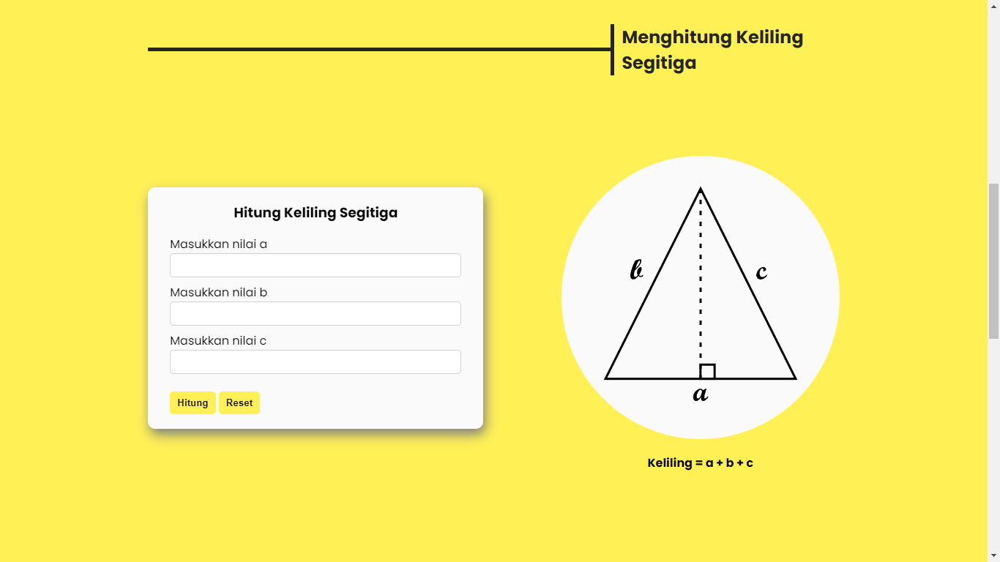
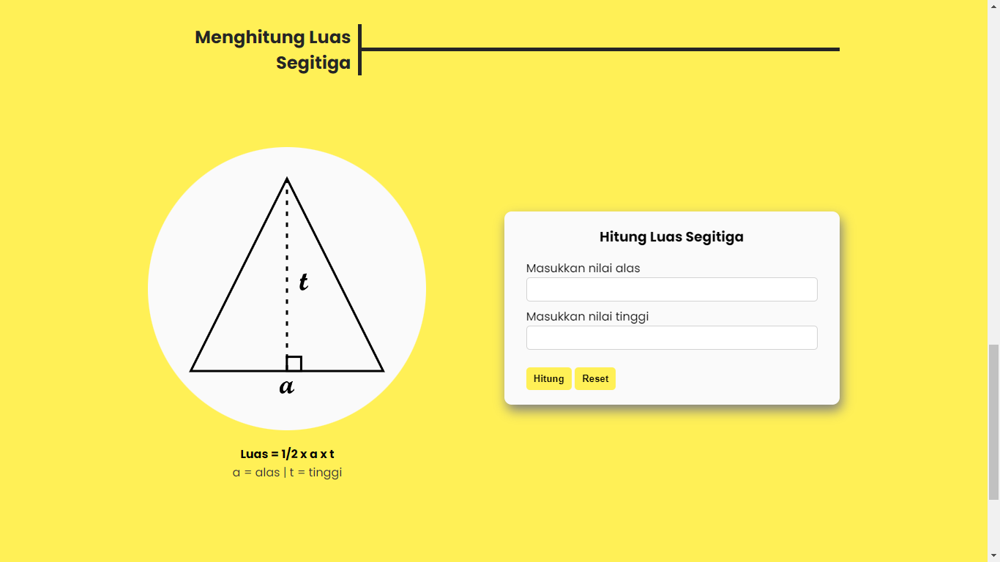

# KaTik - Kalkulator Matematik

## Deskripsi
Kalkulator Matematik (KaTik) adalah sebuah web apps sederhana yang berfungsi untuk menghitung nilai keliling dan luas segitiga.

## Dibuat menggunakan
- HTML
- CSS
- Javascript

## Gambar

